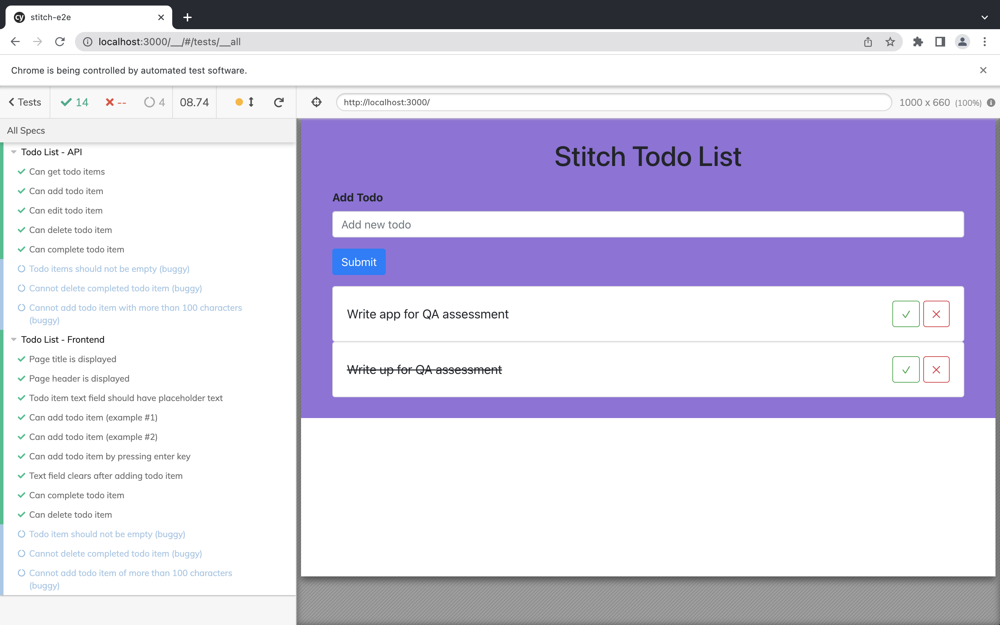
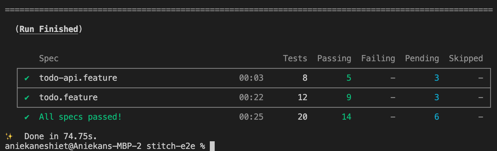

# Stitch Todo List app E2E Testing using Cypress/Typescript

Cypress is a node.js tool to automate the UI/API of a web application.

## Installation

If yarn is not installed install yarn by: `npm i -g yarn`

Then install all packages by doing a `yarn install`

## Assumptions for this assessment

> Ideally a todo application should authenticate a user before creating todo items. However, the application developed for this assessment does not have an authentication layer. This means that there's no way to differentiate todo items per user. That's a massive bug. My assumption is that since this is a basic application, the test scenarios/cases would only cover what has been built which does not include authentication. I am stating this just in case the reviewer expects me to identify this and log bugs based on this observation.

## Task

1. [x] Create a test plan for the todo application
   - **Test Plan**
     - **Scope**: This test plan describes the testing approach and overall framework that will drive the testing of **Stitch Todo List**. This markdown document introduces:
       - **Test Strategy**: rules the test will be based on, including the givens of the project (e.g.: start / end dates, objectives, assumptions); description of the process to set up a valid test (e.g.: entry / exit criteria, creation of test cases, specific tasks to perform, scheduling, data strategy)
       - **Execution Strategy**: describes how the test will be performed and process to identify and report defects, and to fix and implement fixes
       - **Test Management**: process to handle the logistics of the test and all the events that come up during execution (e.g. communications, escalation procedures, risk and mitigation, team roster)

     - **Test Objectives**: The objective of the test is to verify that the functionality of **Stitch Todo List** works according to the requirements. Tests will execute and verify manual and automated test cases, identify, log, and retest all high and medium severity defects per the acceptance criteria, and prioritize lower severity defects for fixing dependent on the time and resources in each sprint. The final product of testing is two-fold:
       - A production-ready software
       - A set of stable test scripts that can be reused for Functional and UAT test execution
     - **Testing Process**: Process to be followed while testing.
       - **Understanding Requirements**:
         - Requirement specifications is sent by Product
         - Understanding of requirements is done by QA team along with development team and questions are asked due to in depth analysis of process flows, boundaries and use case scenarios
         - Questions are collated and sent to Product
         - Response to questions asked are provided by Product
       - **Preparing Test Cases**:
         - QA team will author test cases based on the requirement specifications. This will cover all scenarios for requirements.
       - **Creating Test Data**:
         - Test data will be created by respective QA Engineer on local environment :upside_down_face: based on scenarios and test cases.
       - **Executing Test Cases**:
         - Test cases will be executed by respective QA Engineer on test environment based on designed scenarios, test cases and test data.
         - Test results (Pass/Fail/Blocked) will be updated in test case suite.
       - **Defect Logging and Reporting**: QAs will be logging onto Kanban board (assuming Stitch uses Jira :slightly_smiling_face:) all the defects/bugs found during execution of test cases and during verification of tickets on Kanban boards.
       - **Retesting and Regression Testing**: Retesting for fixed bugs will be done by respective QA once it is resolved by respective developer and bug/defect status will be updated accordingly. In certain cases, regression testing will be done if required.
       - **Deployment/Delivery**: Release/Launch date to Production will be determined by Project stakeholders.
       - **Scope and Levels of Testing**:
         - API testing - testing of individual software components or modules. Done per API specifications.
         - Integration testing – testing of integrated modules to verify combined functionality after integration.
         - Sanity testing – testing to determine if a new software version is performing well enough to accept it for a major testing effort. If application is crashing for initial use then system is not stable enough for further testing and application is assigned to fix.
         - Exploratory - the purpose of this test is to make sure critical defects are removed before the next levels of testing can start. This will include positive and negative tests.
         - Functional - this type of testing ignores the internal parts and focuses on whether the output is per requirement or not.
         - Compatibility testing – testing how well web app performs in most used hardware/software/operating system/network environments.
         - User Acceptance -  this test focuses on validating the business logic. It allows the end users to review the system prior to deployment.
         - System testing – entire system is tested as per the requirements.
         - Regression testing – testing the application as a whole after modifications in any module or functionality.  It is difficult to perform regression testing on the entire application so a selective process of the most critical paths is done.
         - Performance testing – performance testing to check system behavior under load. Will involve testing under heavy loads with several consecutive users, happening within a few seconds of each other. These tests are done to determine at what point the system’s response time degrades or fails.
       - **Test Deliverables**:
         - Test Plan
         - Functional Test Scenarios/Cases
         - Logged defects on JIRA boards
         - Passed tickets on JIRA boards
         - Failed tickets on JIRA boards
         - Daily/Weekly status reports that includes bug reports
         - Test closure report
       - **Features to be Tested**:
         - Stitch Todo List FE
         - Stitch Todo List BE
       - **Test Schedule**: Several phases will be carried out here from plaaning to regression testing. Considering the size of this web app testing shoudn't take more than 16 hours.
       - **Roles & Responsibilities**:
         - Product: Acts as a primary contact for development and test team. Also responsible for Project schedule and the overall success of the project.
         - Test: Responsible for Understanding requirements, writing and executing test cases, preparing Requirement Traceability Matrix (RTM), reviewing test cases, Defect reporting and tracking, retesting and regression testing.
       - **Risks and Risk Management**:
         - No Requirements document has been provided by Product and no Design or API documentation has been provided by the Development team.
         - No Use case scenarios have been provided by Product.
         - There is no single source for UI mockups so there is a high chance of things being out of sync between Product, Dev, Test and UX design teams.
       - **Exit criteria**: There will be extensive and different testing done on test environments before deployment to Production and then sanity testing will be done on Live after deployment to Production.

     - **Test Case Scenarios**
       - API Tests
         - Get all todo lists:
           1. User should be able to get all todos. Ideally user should **only** be able to get todo items created by him/her and not see todo items from other users :smirk:
         - Add todo item:
           1. User should be able to add todo item
           2. Todo item should not be empty (buggy)
           3. User should not be able to add todo item with more than 100 characters (buggy)
         - Edit todo item:
           1. User should be able to edit todo item
         - Delete todo item:
           1. User should be able to delete todo item
           2. User should not be able to delete completed todo item (buggy)
         - Complete todo item:
           1. User should be able to complete todo item
       - UI Tests
         - Launch todo app:
           1. Successful launch of the Stitch Todo FE url <http://localhost:3000> using Internet Explorer browser takes you to the Landing Page.
           2. Successful launch of the Stitch Todo FE url <http://localhost:3000> using Google Chrome browser takes you to the Landing Page.
           3. Successful launch of the Stitch Todo FE url <http://localhost:3000> using Firefox browser takes you to the Landing Page.
           4. Successful launch of the Stitch Todo FE url <http://localhost:3000> using Safari browser takes you to the Landing Page.
           5. Successful launch of the Stitch Todo FE url <http://localhost:3000> using Android browser takes you to the Landing Page.
           6. Successful launch of the Stitch Todo FE url <http://localhost:3000> using Apple browser takes you to the Landing Page.
         - View all todo lists:
           1. User should be able to view all todos
           2. Todos list page should be paginated
         - Add todo item:
           1. User should be able to add todo item
           2. Todo item should not be empty (buggy)
           3. User should not be able to add todo item with more than 100 characters (buggy)
         - Edit todo item (functionality is missing from the FE):
           1. User should be able to edit todo item
         - Delete todo item:
           1. User should be able to delete todo item
           2. User should not be able to delete completed todo item (buggy)
         - Complete todo item:
           1. User should be able to complete todo item

2. [x] Create automated tests for the UI of the todo-list
   - **Framework overview**
     - Framework uses Cypress for UI & API test and Typescript
     - Framework files can be found under `cypress/integration` folder
     - Framework uses BDD approach (cucumber) to test design
     - Tests are written in feature files which have a corresponding folder (with same name) containing test files/steps
     - Framework uses a page object design pattern (for the UI test)
   - **Steps to run**
     - Start both todo frontend and backend apps
     - Run command in root folder: `yarn cypress open`
     - When Cypress app opens, to run test for a single feature file, click on test name e.g. todo.feature (to run UI tests) or todo-api.feature (to run api tests). Or click on "Run 2 integration specs" to run all tests
       - **Test result**
       
3. [x] Create API tests for the backend for the mentioned features
   - **Steps to run**
     - Start both todo frontend and backend apps
     - Run command in root folder: `yarn cypress run`
     - Cypress runs all tests in headless mode and prints result to terminal
       - **Test result**
       

4. [x] Log any bugs found in the application
   - **Bugs/Observations**
     1. No authentication for users. And as a result a user can see all todos from other users and vice versa (API/FE)
     2. User can create empty todo items (API/FE)
     3. User can't edit todo item (FE)
     4. User can delete completed todo items (API/FE)
     5. Passing non-existent `id` deletes the last todo item added to the db. It shouldn't delete any record and instead should return an error (API)
     6. User can add todo item with more than 100 characters and no error is displayed to the user (API/FE)
     7. Application is not paginated
     8. No visual confirmation for actions performed e.g. adding or deleting a todo item
5. [x] Create performance test(s) for the performance requirements of the application
   - **Steps**:
     1. Ensure an exact replica of the production environment is available
     2. Write performance test scripts using JMeter for the following checks:
        - Application's ability to create 10 todo items per second within 10am and 12pm
        - Application's ability to create 10 todo items per second before 10am and after 12pm
        - Application's ability to create 12 todo items of  per second within 10am and 12pm. Increment by 2 until application crashes or there is serious degradation in performance
     3. Provide report to the development team
